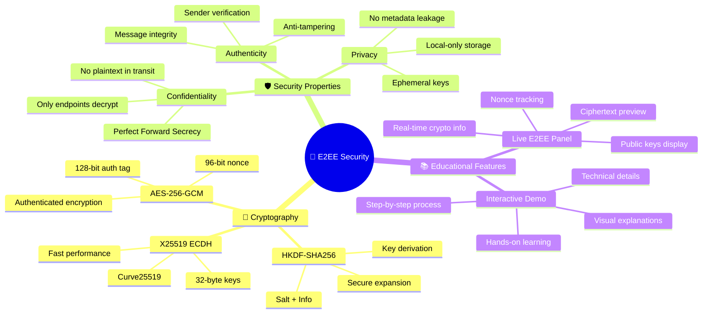
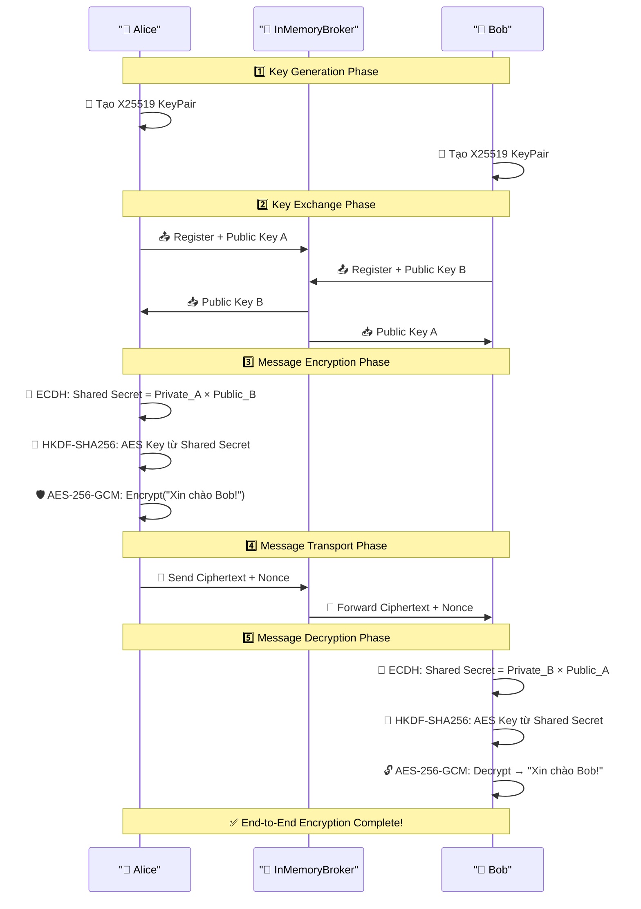
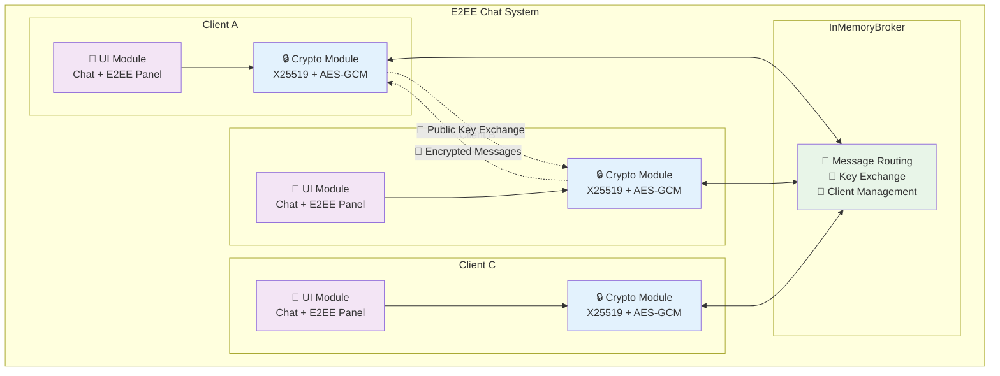

# 🔐 Ứng Dụng Chat E2EE Mini

> **Ứng dụng chat mã hóa đầu cuối (End-to-End Encryption) với giao diện đẹp mắt và tính năng giáo dục**

[](https://python.org)
[](https://pypi.org/project/PySide6/)
[](LICENSE)

## 📋 Mô Tả

Ứng dụng chat E2EE Mini là một dự án giáo dục nhằm minh họa cách thức hoạt động của mã hóa đầu cuối. Ứng dụng cho phép người dùng:

- 💬 **Chat an toàn**: Tạo nhiều cửa sổ chat và trò chuyện với nhau
- 🔒 **E2EE thực sự**: Sử dụng X25519 + AES-GCM cho bảo mật tối đa
- 📚 **Tính năng giáo dục**: Hiển thị chi tiết quá trình mã hóa/giải mã
- 🎨 **Giao diện hiện đại**: UI/UX đẹp mắt với gradient và animation
- 💾 **Lưu trữ lịch sử**: Tự động lưu và khôi phục cuộc trò chuyện
- 🌐 **Đa nền tảng**: Chạy trên Windows, Linux, macOS

## 🛡️ Tính Năng Bảo Mật



### 🔑 Mã Hóa Mạnh Mẽ
- **X25519**: Elliptic Curve Diffie-Hellman key exchange
- **AES-256-GCM**: Authenticated encryption với 256-bit key
- **HKDF-SHA256**: Key derivation function để tạo AES key
- **Ephemeral Keys**: Khóa mới cho mỗi phiên, không lưu trữ

### 🔍 Tính Năng Giáo Dục
- **Live E2EE Panel**: Hiển thị real-time thông tin mã hóa
- **Demo tương tác**: Minh họa trực quan quá trình E2EE
- **Chi tiết kỹ thuật**: Hiển thị public key, nonce, ciphertext
- **Giải thích dễ hiểu**: Hướng dẫn từng bước về E2EE

## 🚀 Cài Đặt Nhanh

### 📦 Yêu Cầu Hệ Thống
- **Python**: 3.8 trở lên
- **RAM**: Tối thiểu 512MB
- **Dung lượng**: ~50MB sau khi cài đặt
- **Hệ điều hành**: Windows 10+, Ubuntu 18.04+, macOS 10.14+

### ⚡ Khởi Chạy Tự Động

#### 🐧 Linux/macOS:
```bash
chmod +x scripts/start.sh
./scripts/start.sh
```

#### 🪟 Windows:
```cmd
scripts\start.bat
```

Script tự động sẽ:
1. ✅ Tạo virtual environment (nếu chưa có)
2. ✅ Cài đặt dependencies từ `require.txt`
3. ✅ Khởi chạy ứng dụng

### 🔧 Cài Đặt Thủ Công

```bash
# Tạo virtual environment
python3 -m venv .venv

# Kích hoạt environment
source .venv/bin/activate  # Linux/macOS
# hoặc
.venv\Scripts\activate.bat  # Windows

# Cài đặt dependencies
pip install -r require.txt

# Chạy ứng dụng
python -m app.main
```

## 🎮 Hướng Dẫn Sử Dụng


### 1️⃣ Khởi Tạo Chat
1. Mở ứng dụng → Nhập tên hiển thị
2. Click **"MỞ CỬA SỔ CHAT"**
3. Lặp lại để tạo nhiều cửa sổ chat

### 2️⃣ Trò Chuyện An Toàn
1. Chọn người nhận từ dropdown **"Gửi đến"**
2. Nhập tin nhắn → Click **Gửi** hoặc nhấn **Enter**
3. Tin nhắn được mã hóa E2EE trước khi gửi

### 3️⃣ Theo Dõi E2EE
- **Panel bên phải**: Hiển thị thông tin mã hóa real-time
- **Tab "Giải thích E2EE"**: Tìm hiểu chi tiết về E2EE
- **Demo tương tác**: Thử nghiệm mã hóa/giải mã

### 4️⃣ Quản Lý Lịch Sử
- **Tự động lưu**: Mọi cuộc trò chuyện được lưu vào `data/`
- **Khôi phục**: Click vào tên trong **"Lịch sử chat"** để mở lại
- **Avatar màu**: Mỗi người dùng có màu avatar riêng biệt

## 📁 Cấu Trúc Dự Án

### 🗂️ Tổ chức thư mục
- **`app/`**: Source code chính của ứng dụng
- **`data/`**: Lưu trữ lịch sử chat
- **`documentation/`**: Tất cả tài liệu được tổ chức theo loại
- **`scripts/`**: Script khởi chạy cho các hệ điều hành
- **`.venv/`**: Virtual environment (tự động tạo)
- **`require.txt`**: Danh sách dependencies Python

```mermaid
graph TD
    A["📁 e2eee/"] --> B["📂 app/"]
    A --> C["📂 data/"]
    A --> D["📂 .venv/"]
    A --> E["📂 documentation/"]
    A --> F["📂 scripts/"]
    A --> G["📋 require.txt<br/><small>Python Dependencies</small>"]
    A --> H["📖 README.md<br/><small>Main Documentation</small>"]
    
    B --> B1["🐍 main.py<br/><small>Entry point, App setup</small>"]
    B --> B2["🔒 crypto.py<br/><small>E2EE Implementation</small>"]
    B --> B3["🚀 transport.py<br/><small>Message Broker</small>"]
    B --> B4["🎨 ui.py<br/><small>GUI Components</small>"]
    B --> B5["📋 __init__.py<br/><small>Package Init</small>"]
    
    C --> C1["📄 *.html<br/><small>Chat History Files</small>"]
    D --> D1["📦 PySide6, cryptography<br/><small>Virtual Environment</small>"]
    
    E --> E1["📂 user-guide/<br/><small>User Documentation</small>"]
    E --> E2["📂 technical/<br/><small>API & Changelog</small>"]
    E --> E3["📂 academic/<br/><small>Reports & Presentations</small>"]
    
    F --> F1["🚀 start.sh<br/><small>Linux/macOS Launcher</small>"]
    F --> F2["🚀 start.bat<br/><small>Windows Launcher</small>"]
    
    style A fill:#e1f5fe
    style B fill:#f3e5f5
    style C fill:#e8f5e8
    style D fill:#fff3e0
    style E fill:#e8eaf6
    style F fill:#e0f2f1
    style G fill:#ffebee
    style H fill:#f9fbe7
```



## 🔬 Chi Tiết Kỹ Thuật

### 🔐 Quy Trình E2EE



**Chi tiết từng bước:**
1. **Key Generation**: Mỗi client tạo cặp khóa X25519
2. **Key Exchange**: Trao đổi public key qua broker
3. **Shared Secret**: ECDH tạo shared secret
4. **Key Derivation**: HKDF-SHA256 tạo AES-256 key
5. **Encryption**: AES-256-GCM mã hóa tin nhắn
6. **Transport**: Chỉ ciphertext được gửi qua broker
7. **Decryption**: Receiver giải mã bằng shared key

### 🏗️ Kiến Trúc Hệ Thống



### 📦 Dependencies

| Package | Version | Mục Đích |
|---------|---------|----------|
| **PySide6** | 6.6+ | GUI framework hiện đại |
| **cryptography** | 42+ | Thư viện mã hóa mạnh mẽ |

## 💾 Lưu Trữ & Bảo Mật

### 📄 Định Dạng Lưu Trữ
- **Format**: HTML với UTF-8 encoding
- **Location**: `data/{display-name}.html`
- **Content**: Chỉ tin nhắn đã giải mã (plaintext)

### 🔒 Chính Sách Bảo Mật
- ✅ **Keys không lưu trữ**: Ephemeral keys, tạo mới mỗi session
- ✅ **Forward Secrecy**: Tin nhắn cũ an toàn khi key mới bị lộ
- ✅ **Local Only**: Không có kết nối internet, chạy hoàn toàn offline
- ✅ **Open Source**: Code mở, có thể audit bảo mật

## 🎨 Tính Năng UI/UX

### 🌈 Giao Diện Hiện Đại
- **Gradient Background**: Màu sắc chuyển tiếp mượt mà
- **Avatar Đa Màu**: 26 màu khác nhau cho từng chữ cái
- **Messenger-Style Bubbles**: Tin nhắn hiển thị như Facebook Messenger
- **Responsive Design**: Tự động điều chỉnh kích thước
- **Fullscreen Support**: Hoạt động mượt mà ở mọi kích thước cửa sổ

### ⚡ Hiệu Ứng Tương Tác
- **Hover Effects**: Hiệu ứng khi di chuột
- **Smooth Animations**: Chuyển tiếp mượt mà
- **Resizable Panels**: Kéo thả panel E2EE với splitter mượt mà
- **Real-time Updates**: Cập nhật thông tin tức thì
- **Event Filter**: Xử lý thông minh khi thay đổi kích thước cửa sổ

### 🔍 Panel E2EE Nâng Cao
- **Hiển thị đầy đủ**: Tất cả giá trị mã hóa hiển thị hoàn chỉnh
- **Hash khóa bí mật**: 64 ký tự hex đầy đủ (thay vì cắt ngắn)
- **Shared Secret**: 64 ký tự hex đầy đủ
- **Ciphertext**: Toàn bộ bản mã (không bị cắt)
- **AES Key**: 64 ký tự hex đầy đủ
- **Nonce**: 24 ký tự hex đầy đủ

## 🛠️ Phát Triển

### 📚 Code Documentation
- **Docstring đầy đủ**: Tất cả module, class, và function đều có docstring tiếng Việt
- **Type hints**: Sử dụng type annotations cho tất cả function
- **Comment chi tiết**: Giải thích logic phức tạp bằng tiếng Việt
- **Cấu trúc rõ ràng**: Code được tổ chức theo module chức năng

### 🧪 Chạy Tests
```bash
# Sẽ được thêm trong phiên bản tương lai
python -m pytest tests/
```

### 🐛 Debug Mode
```bash
# Chạy với debug logging
PYTHONPATH=. python -m app.main --debug
```

### 📖 Đọc Code
```bash
# Xem docstring của module
python -c "import app.crypto; help(app.crypto)"

# Xem docstring của class
python -c "from app.crypto import KeyPair; help(KeyPair)"

# Xem docstring của function
python -c "from app.crypto import derive_shared_key; help(derive_shared_key)"
```

### 📝 Đóng Góp
1. Fork repository
2. Tạo feature branch: `git checkout -b feature-amazing`
3. Commit changes: `git commit -m 'Add amazing feature'`
4. Push to branch: `git push origin feature-amazing`
5. Tạo Pull Request

## ⚠️ Lưu Ý Bảo Mật

> **Chỉ dành cho mục đích giáo dục và demo**

- 🔴 **Không sử dụng cho production**: Đây là ứng dụng demo
- 🔴 **Broker không bảo mật**: InMemoryBroker có thể thấy metadata
- 🔴 **Không có authentication**: Không xác thực danh tính người dùng
- 🔴 **Local storage**: Lịch sử chat lưu dạng plaintext

## 🆘 Hỗ Trợ

### 🐛 Gặp Lỗi?
1. **Kiểm tra Python version**: `python --version` (cần >= 3.8)
2. **Cài đặt lại dependencies**: `pip install -r require.txt --force-reinstall`
3. **Xóa virtual environment**: `rm -rf .venv` và chạy lại script

### 💡 Tính Năng Mới?
- Mở issue trên GitHub với tag `enhancement`
- Mô tả chi tiết tính năng mong muốn
- Giải thích use case cụ thể

