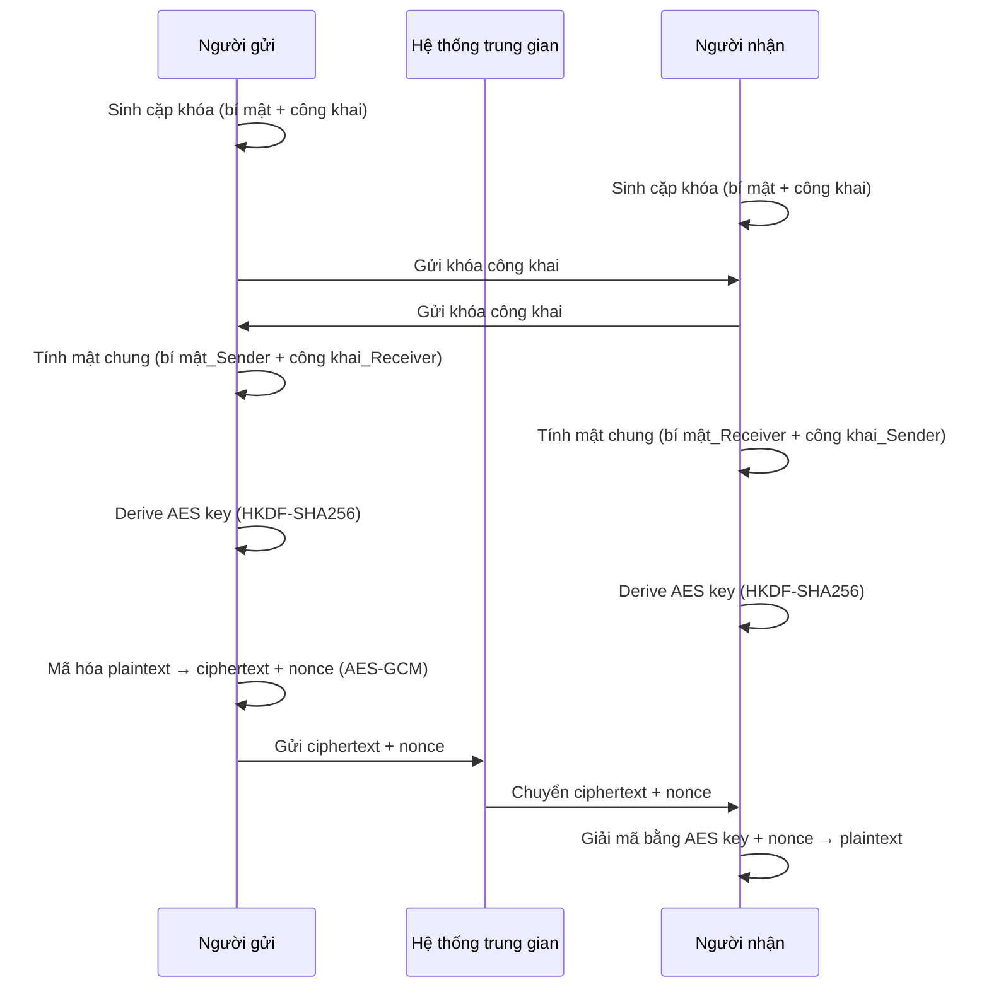

### **Kịch Bản Thuyết Trình Hoàn Chỉnh: "Hành Trình Xây Dựng Chiếc Hộp Bí Mật"**

#### **Phần 1: Giấc Mơ Về Sự Riêng Tư**

**(Bắt đầu)**

"Xin chào mọi người. Hôm nay, chúng ta sẽ tạm gác lại những thuật toán phức tạp để cùng nhau bắt đầu một cuộc phiêu lưu: hành trình xây dựng một **chiếc hộp bí mật** hoàn hảo."

"Hãy tưởng tượng, bạn có một chiếc hộp. Bất cứ thứ gì bạn đặt vào trong, khóa lại và gửi đi, bạn có một lời đảm bảo tuyệt đối rằng **chỉ có và chỉ có người bạn muốn** mới có thể mở được nó. Không một ai khác trên đời - kể cả người vận chuyển, người chế tạo ra chiếc hộp - có thể liếc nhìn vào bên trong.

Đó là một giấc mơ đẹp, phải không? Giấc mơ về sự riêng tư tuyệt đối. Trong thế giới số, nơi mọi thông tin đều có thể bị sao chép, giấc mơ đó có vẻ như là bất khả thi. Nhưng hôm nay, chúng ta sẽ cùng nhau biến nó thành hiện thực. Hành trình của chúng ta có 3 chặng, tương ứng với 3 câu đố lớn cần giải đáp."

---
#### **Phần 2: Câu Đố Lớn Đầu Tiên - Bài Toán Về Chìa Khóa**

"Để có một chiếc hộp bị khóa, hiển nhiên chúng ta cần một cái chìa khóa. Đây là lúc vấn đề đầu tiên xuất hiện, và là vấn đề lớn nhất."

**[Dựng lên vấn đề]**

"Giả sử tôi và bạn muốn trao đổi bí mật. Tôi tạo ra một chiếc hộp và một chiếc chìa khóa. Tôi giữ hộp, và tôi cần gửi chìa khóa cho bạn. Nhưng người đưa thư có thể là một gián điệp. Nếu tôi đưa chìa khóa cho anh ta, anh ta có thể trên đường đi ghé qua tiệm sửa khóa và sao chép nó. Kể từ đó, mọi chiếc hộp tôi gửi cho bạn, anh ta đều có thể mở được."

"Vậy tôi thử một cách khác. Tôi làm ra hai chìa khóa giống hệt nhau. Tôi giữ một chiếc, và tìm cách gặp bạn để đưa chiếc còn lại. Nhưng nếu chúng ta ở hai đầu đất nước thì sao? Chúng ta không thể gặp nhau."

**[Câu hỏi Gợi mở 1 - Nhấn mạnh sự bế tắc]**

"Vậy, chúng ta đang ở trong một tình thế tiến thoái lưỡng nan. Để trao đổi bí mật, chúng ta cần một kênh bí mật để gửi chìa khóa. Nhưng để có một kênh bí mật, chúng ta lại cần có chìa khóa. Nó là một vòng luẩn quẩn."

"Mọi người có thấy sự bế tắc ở đây không ạ? **Làm thế nào để hai người chưa từng gặp mặt có thể thống nhất được một bí mật chung?**"

**(Dừng lại, để khán giả thật sự cảm nhận được sự "bất khả thi" của vấn đề)**

"Trong nhiều năm, câu trả lời là 'không thể'. Cho đến khi một ý tưởng đi ngược lại mọi logic thông thường xuất hiện..."

---
#### **Phần 3: Lời Giải Đột Phá - Chiếc Khóa Kỳ Diệu**

"Ý tưởng đó là: **Đừng cố gắng trao đổi chìa khóa nữa. Thay vào đó, hãy trao đổi ổ khóa.**"

**[Xây dựng hình ảnh]**

"Bây giờ, hãy quên chiếc hộp cũ đi. Hãy tưởng tượng chúng ta đến gặp một người thợ khóa siêu phàm. Thay vì làm ra một bộ khóa-chìa bình thường, ông ấy đưa cho bạn một bộ đôi ma thuật:
* Một **Chiếc Chìa Khóa Riêng (Private Key)**: Nó là độc nhất vô nhị. Bạn sẽ khắc tên mình lên đó và không bao giờ cho bất kỳ ai xem.
* Một đống **Ổ Khóa Giống Hệt Nhau (Public Key)**: Ông ấy đưa bạn cả một thùng ổ khóa. Chúng đều giống hệt nhau và chỉ có thể được mở bằng chiếc chìa khóa riêng của bạn. Bạn có thể thoải mái cho, tặng, rải những chiếc ổ khóa này ra khắp nơi."

"Quy tắc của bộ đôi này là: **Ai cũng có thể lấy một trong những chiếc ổ khóa của bạn để khóa một thứ gì đó lại. Nhưng một khi đã khóa, chỉ có chiếc chìa khóa riêng của bạn mới có thể mở được.**"

**[Cùng khán giả giải bài toán]**

"Bây giờ, hãy quay lại với An và Bình."

**[Câu hỏi Gợi mở 2 - Dẫn dắt từng bước]**

"An muốn gửi một lá thư bí mật cho Bình. Cả hai đều đã đến gặp người thợ khóa và có bộ đôi ma thuật của riêng mình."

"Bước đầu tiên, An cần làm gì ạ? An có cần chìa khóa của Bình không?"
**(Câu trả lời là không)**
"An có cần ổ khóa của mình không?"
**(Câu trả lời là không)**
"Vậy An cần gì từ Bình?"
**(Dẫn dắt đến câu trả lời: An cần Ổ KHÓA của Bình)**

"Chính xác!
1.  **Bước 1:** An gọi điện cho Bình và nói 'Này Bình, gửi cho tôi một cái ổ khóa của cậu đi'.
2.  **Bước 2:** Bình vui vẻ gửi ngay, vì ổ khóa này là công khai, có cho cả thế giới cũng không sao.
3.  **Bước 3:** An nhận được ổ khóa của Bình. An viết lá thư, cho vào hộp, và dùng chính **ổ khóa của Bình** để khóa lại.
4.  **Bước 4:** An gửi chiếc hộp đã khóa cho Bình. Gián điệp trên đường đi có bắt được chiếc hộp cũng đành bó tay. Anh ta có thể có ổ khóa của Bình, nhưng ổ khóa không thể dùng để mở.
5.  **Bước 5:** Bình nhận được hộp, anh ấy thong thả lấy **chiếc chìa khóa riêng** của mình ra và mở hộp. Bí mật đã được trao đổi thành công."

"Không cần gặp mặt, không cần gửi bí mật, họ đã giải quyết được bài toán hóc búa nhất. Đây chính là bản chất của **Mã hóa Bất đối xứng (Asymmetric Cryptography)**."

---
#### **Phần 4: Từ Một Lá Thư Đến Cả Một Cuộc Trò Chuyện**

"Phương pháp 'Ổ khóa - Chìa khóa' này cực kỳ chắc chắn, nhưng nó hơi chậm và phức tạp. Nó giống như việc bạn phải thực hiện cả một quy trình an ninh nghiêm ngặt chỉ để nói một câu 'Chào buổi sáng'."

"Vậy làm thế nào để chúng ta có thể trò chuyện nhanh chóng, liên tục mà vẫn an toàn?"

**[Câu hỏi Gợi mở 3 - Xây dựng giải pháp tiếp theo]**

"Chúng ta đã có một cách siêu an toàn để gửi chiếc hộp đầu tiên. Vậy theo mọi người, chúng ta nên đặt thứ gì vào trong chiếc hộp đầu tiên đó, để giúp cho hàng trăm tin nhắn sau này được trao đổi một cách chớp nhoáng?"

**(Gợi ý cho khán giả: "Một thứ gì đó đơn giản hơn, nhanh hơn, mà cả hai có thể dùng chung?")**

"Một ý tưởng tuyệt vời! Thay vì đặt lá thư đầu tiên vào đó, An sẽ đặt vào trong một **bộ đàm đồ chơi**, với một tần số bí mật đã được cài đặt sẵn. An dùng 'phương pháp ổ khóa' để gửi an toàn chiếc hộp chứa bộ đàm này cho Bình."

"Kể từ đó:
1.  Họ cất bộ 'Ổ khóa - Chìa khóa' đi.
2.  Tất cả các cuộc trò chuyện sau đó, họ sẽ dùng **bộ đàm (Khóa Phiên Đối xứng - Symmetric Session Key)** với tần số bí mật đó để nói chuyện với nhau. Nó siêu nhanh và hiệu quả.
3.  Và quan trọng nhất: Sau khi nói chuyện xong, họ cùng nhau **tháo pin và vứt bộ đàm đó đi**. Lần sau nói chuyện, họ sẽ lại dùng 'phương pháp ổ khóa' để gửi một bộ đàm mới với một tần số mới."

"Việc 'vứt bộ đàm sau khi dùng' này được gọi là **Bảo mật Chuyển tiếp Hoàn hảo (Perfect Forward Secrecy)**. Nó đảm bảo rằng, nếu một ngày nào đó chìa khóa riêng của Bình bị trộm, tên trộm cũng không thể nghe lại được những cuộc trò chuyện cũ, vì những 'bộ đàm' dùng cho chúng đã không còn tồn tại."

---
#### Kiến trúc E2EE

---

#### **Phần 5: Project Của Tôi - Tái Hiện Lại Toàn Bộ Câu Chuyện**

"Nãy giờ, chúng ta đã cùng nhau phiêu lưu qua một câu chuyện của những ý tưởng. Và để biến câu chuyện đó thành thứ mà các bạn có thể thấy và chạm vào, tôi đã xây dựng một ứng dụng."

"Ứng dụng này chính là người thợ khóa, là người đưa thư, và là căn phòng trò chuyện của An và Bình. Hãy cùng xem câu chuyện của chúng ta được tái hiện như thế nào."

**(Mở ứng dụng lên và trình diễn)**

1.  **"Bước 1: Gặp người thợ khóa."**
    "Khi tôi mở cửa sổ cho 'An' và 'Bình', ngay lập tức 'người thợ khóa' (thuật toán **X25519**) đã làm việc, tạo ra cho mỗi người một bộ 'Ổ khóa - Chìa khóa' riêng."

2.  **"Bước 2: Gửi chiếc hộp đầu tiên chứa 'bộ đàm'."**
    "Bây giờ, khi tôi gõ tin nhắn đầu tiên từ An và nhấn Gửi, ứng dụng đang thực hiện 'phương pháp ổ khóa' để gửi đi 'bộ đàm' (tức là **Khóa AES**) một cách an toàn. Quá trình này được gọi là **Trao đổi khóa Diffie-Hellman**."

3.  **"Bước 3: Cuộc trò chuyện qua bộ đàm."**
    "(Chỉ vào panel E2EE) Chuỗi ký tự khó hiểu này (**Ciphertext**) chính là giọng nói đã được mã hóa qua 'bộ đàm'. Chỉ có máy của Bình, với 'bộ đàm' tương ứng, mới có thể dịch nó ngược lại thành tin nhắn ban đầu."

"Toàn bộ hành trình phức tạp đó, từ việc giải bài toán chìa khóa đến việc trò chuyện tốc độ cao, tất cả đã diễn ra trong nháy mắt."

"Như vậy, Mã hóa Đầu-cuối (End-to-End Encryption) không phải là một thứ gì đó xa vời. Nó là một chuỗi các giải pháp rất thông minh cho một vấn đề rất đời thường. Nó là công cụ giúp chúng ta có lại được sự riêng tư trong thế giới số."

"Cảm ơn mọi người đã cùng tôi tham gia vào hành trình này."

